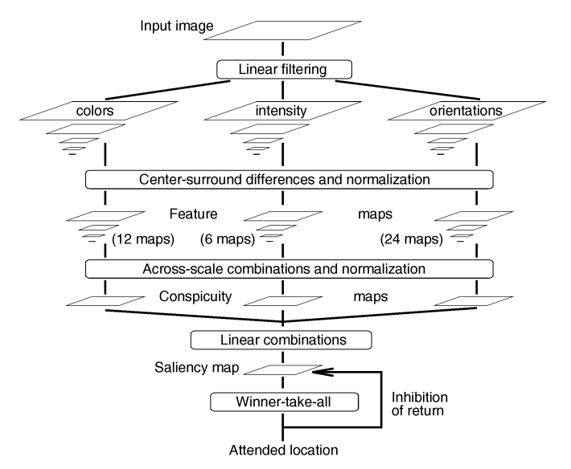
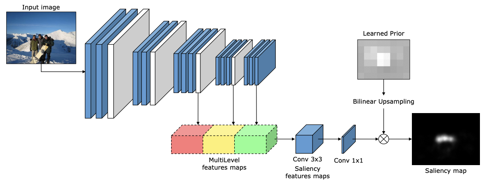
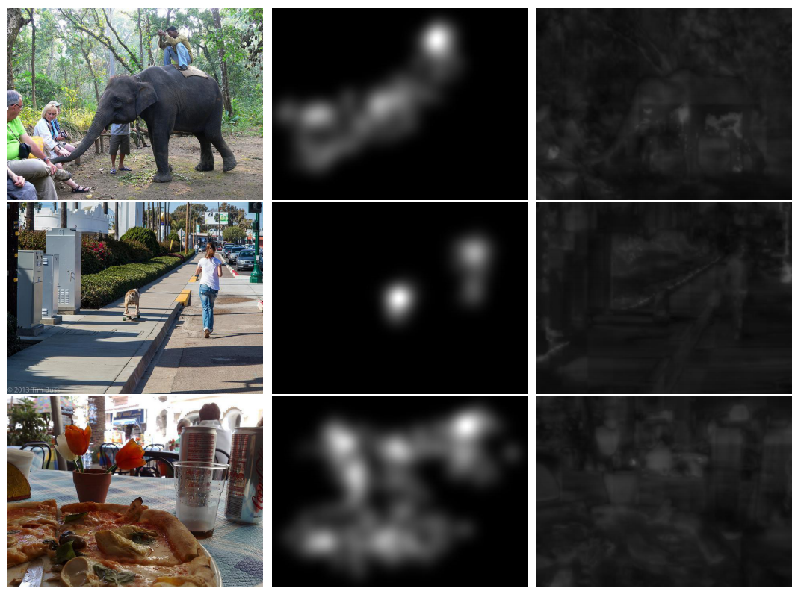
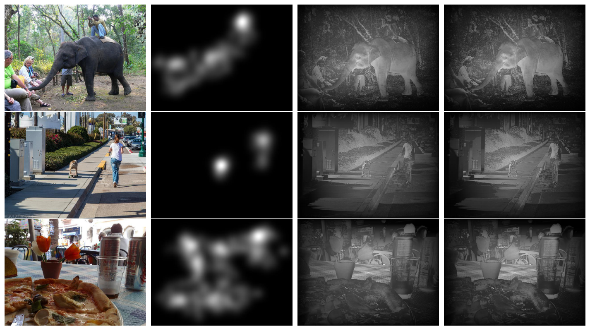
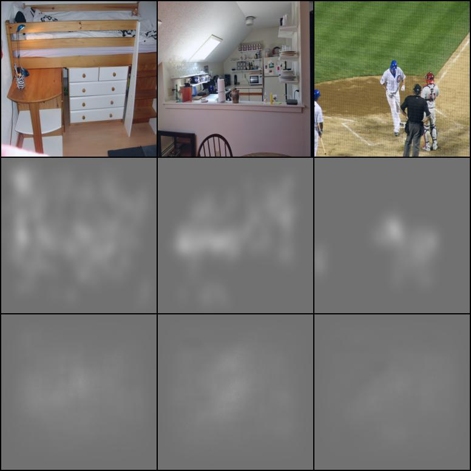

# Saliency Detection

[Homework] Fanpeng Meng's Homework for Visual Cognition Engineering 2022-Spring, School of AIA, HUST.

## Summary

In this work, I implied three algorithm on saliency detection, including non-learning-based algorithm `ITTI`, `MDC` and learning-based model `MLNet` on SALICON Dataset, and gave a visualize result of three models. 

**ITTI** [[paper]](https://ieeexplore.ieee.org/abstract/document/730558) &nbsp;
**MDC** [[paper]](https://ieeexplore.ieee.org/abstract/document/7937833) &nbsp;
**MLNet** [[paper]](https://arxiv.org/abs/1609.01064) [[code]](https://github.com/marcellacornia/mlnet)

**[DATASET]** **SALICON** [[web]](http://salicon.net/challenge-2017/) 


<div align=center>
    
    
    <br>ITTI & MLNet
</div>


## Installation

Using commands to install the environment:

```bash
pip -r requirements.txt
```
    
## Data Preparation

Prepare your dataset as below: 

````
dataset 
  └──── SALICON
    ├──── images 
    │ ├──── test
    │ │ ├──── COCO_test2014_000000000001.jpg
    │ │ └──── ...
    │ ├──── train
    │ │ ├──── COCO_train2014_000000000001.jpg
    │ │ └──── ...
    │ └──── val
    │   ├──── COCO_val2014_000000000001.jpg
    │   └──── ...
    └──── images 
      ├──── train
      │ ├──── COCO_train2014_000000000001.jpg
      │ └──── ...
      └──── val
        ├──── COCO_val2014_000000000001.jpg
        └──── ...
````

## Training and Testing

### ITTI & MDC

Testing on ITTI and MDC :

```python
python main.py
```

We randomly choose 10 pictures for testing, see result in `output/itti` and `output/mdc`. 

### MLNet

Training on MLNet, you can also configure the training in the shell:

```bash
bash train.sh
```

* I trained the model on a single **NVIDIA A30 (24 GB)**. 200 epoch with batch size of 64 training takes about 2.5 hours. 

Testing on MLNet

```python
python test.py
```

We also randomly choose 10 pictures for testing, see result in `output/mlnet`. 

* The checkpoint will be upload on [Google Drive](https://drive.google.com/drive/folders/1rcRVgAWpvkj63vZszgWJaIysGZ25oFF0?usp=sharing), place it at `output/mlnet/checkpoint` if you haven't trained the model, or you can change the directory in `test.py`. 

## Result and Explaination

The result is shown below :

<div align=center>
    
    <br>Result of ITTI
</div>

The result is shown by the sequence of: the real image, the ground true image, the result.

<div align=center>
    
    <br>Result of MDC
</div>

The result is shown by the sequence of: the real image, the ground true image, the result, the result with image enhancement.

<div align=center>
    
    <br>Result of MLNet
</div>

The result is shown by the sequence of: the real image, the ground true image, the result.

## Contract

Mail me at [HUST-Mail](fanpengmeng@hust.edu.cn) or [Gmail](fpmeng0610@gmail.com)

## Referenc

The following works are appreciated for great credit to my work:

```
@article{itti1998model,
  title={A model of saliency-based visual attention for rapid scene analysis},
  author={Itti, Laurent and Koch, Christof and Niebur, Ernst},
  journal={IEEE Transactions on pattern analysis and machine intelligence},
  volume={20},
  number={11},
  pages={1254--1259},
  year={1998},
  publisher={Ieee}
}

@inproceedings{cornia2016deep,
  title={A deep multi-level network for saliency prediction},
  author={Cornia, Marcella and Baraldi, Lorenzo and Serra, Giuseppe and Cucchiara, Rita},
  booktitle={2016 23rd International Conference on Pattern Recognition (ICPR)},
  pages={3488--3493},
  year={2016},
  organization={IEEE}
}

@article{huang2017300,
  title={300-FPS salient object detection via minimum directional contrast},
  author={Huang, Xiaoming and Zhang, Yu-Jin},
  journal={IEEE Transactions on Image Processing},
  volume={26},
  number={9},
  pages={4243--4254},
  year={2017},
  publisher={IEEE}
}
```
